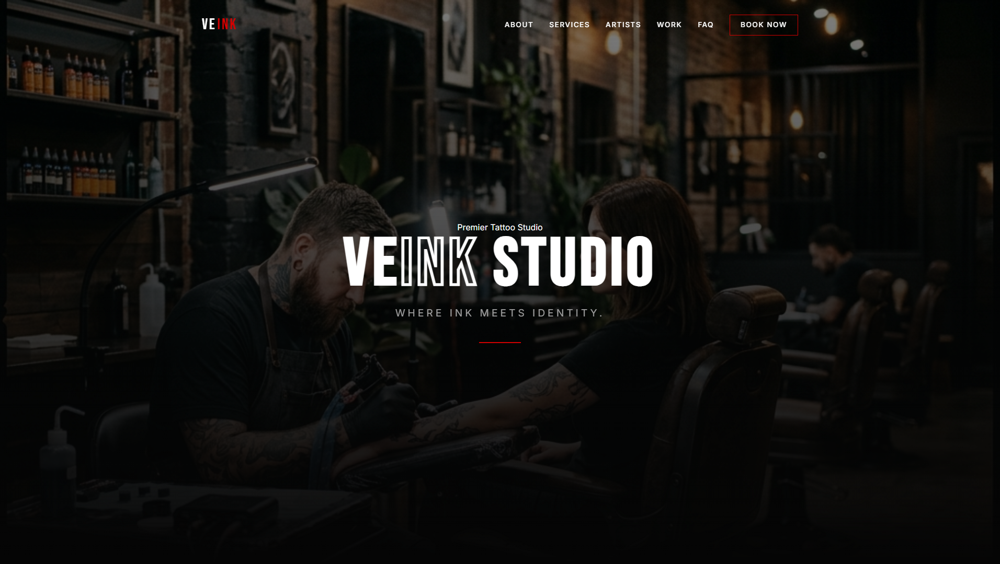

# ✦ VeInk Studio — Where ink meets identity

  

VeInk Studio is a premium, high-performance landing page for a modern tattoo collective. Built with **Astro 6**, it features a sleek dark aesthetic, fluid animations, and a focus on artistic storytelling.

[View Live Demo](https://alextsdev.github.io/veink-studio/) · [Report Bug](https://github.com/alextsdev/veink-studio/issues) · [Request Feature](https://github.com/alextsdev/veink-studio/issues)

---

## ✨ Features

- **🎯 Artistic Narrative**: A carefully crafted "About" section that highlights the studio's philosophy.
- **🎨 Interactive Gallery**: A modern grid-based portfolio with a built-in lightbox for detailed work viewing.
- **⚡ Performance First**: Optimized images and zero-JS (mostly) implementation thanks to Astro's islands architecture.
- **📱 Ultra Responsive**: Fluid layout that adapts seamlessly from high-res monitors to mobile devices.
- **📅 Booking Integration**: Functional consultation form to streamline the client onboarding process.
- **🌑 Premium Aesthetics**: Custom-tailored dark mode with "Bebas Neue" typography and subtle grain textures.

---

## 🛠️ Tech Stack

- **Framework:** [Astro 6.0+](https://astro.build/)
- **Styling:** Vanilla CSS (Modern CSS properties & Variables)
- **Icons:** Lucide Icons
- **Fonts:** [Bebas Neue](https://fonts.google.com/specimen/Bebas+Neue) & [Inter](https://fonts.google.com/specimen/Inter)
- **Deployment:** [Vercel](https://vercel.com) / [Netlify](https://www.netlify.com)

---

  Developed by <a href="https://github.com/alextsdev">Alextsdev</a>

